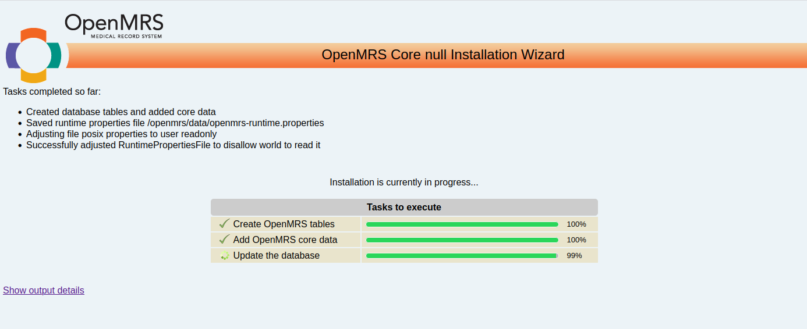
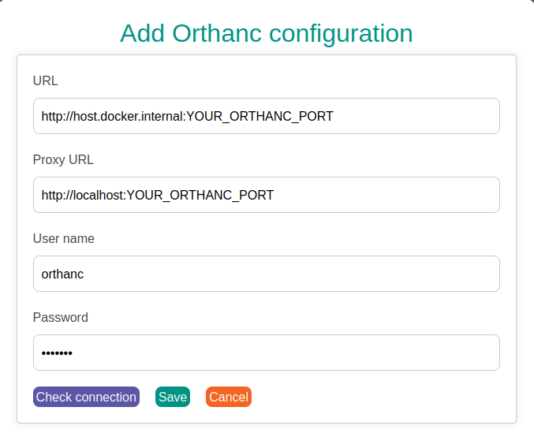

# OpenMRS patient imaging module docker compose (Orthanc integration)

## Overview
This project provides a Docker setup for the OpenMRS 2.x and OpenMRS 3.x Imaging module. It contains all the configuration files and libraries needed to run the application with Orthanc integration.

## Configure your local Orthanc server
Update your orthanc setup by replacing and adding the following files:

- Replace/modify the existing `orthanc.json` in `/etc/orthanc` directory with the one from this project and restart the Orthanc server.
> **Note:** Please update the port configuration as follows:
- OpenMRS2.x Docker container -> use port **2222**
- OpenMRS3.x Docker container -> use port **3030**

- Copy the Orthanc worklist script in the `orthanc` folder: 

    ```bash
    cp orthancWorklist.py /etc/orthanc/
    ```
- Copy the Python plugin configuration:
    ```bash
    cp python.json /etc/orthanc/
    ``` 

## Running the Docker container

### Start the Docker container for OpenMRS 2.x:
  ```bash
  docker compose -f docker-compose-openmrs2.yml up
  ```
> **Note**
  - The installation process may take some time.
  - In some cases, you may need to stop the container and restart it to complete the setup successfully.
  - You may experience display issues within the application after importing the new module into Docker or updating to a new release. To resolve these issues, follow these steps:
    - Stop the containers: 
      - For **OpenMRS2.x**: `docker compose -f docker-compose-openmrs2.yml down`
    - Restart the containers: 
      - For **OpenMRS2.x**: `docker compose -f docker-compose-openmrs2.yml up`

    - If problems persist, clear your browser data:
        - Cookies and site data (e.g., 134 MB)
        - Cached files and pages (e.g., 393 MB)

### Login to **OpenMRSMRS 2.x**
- User: **admin**
- Password: **Admin123**
> **Note**: If logging in with `Admin123` doesn’t work:
  - Use the password `test` to log in.
  - After logging in, go to your `Admin account` settings OpenMRS and change the password.

## Start the Docker container for OpenMRS 3.x:
  ```bash
  docker-compose up
  ```
  > **Note**
  - The installation process may take some time. You can monitor the progress of the setup by visiting
  ```bash
  http://localhost:3030/openmrs/initialsetup
  ```

  

  - In some cases, you may need to stop the container and restart it to complete the setup successfully.

  - Remove the container
  ```bash
  docker-compose down    
  ```
  ### Running OpenMRS with the imaging module
  You have two options for running the Imaging module:

  - Running via Docker (micro-frontend 3 image)

    - Start the micro-frontend 3:
      ```bash
      http://localhost/openmrs/spa
      ```
    - Validate backend connection:
      ```bash
      http://localhost:3030/openmrs/
      ```
> **Note**

You may experience display issues within the application after importing the new module into Docker or updating to a new release. To resolve these issues, follow these steps:
- Stop the containers: `docker-compose down`
- Restart the containers: `docker-compose up`
- If problems persist, clear your browser data:
    - Cookies and site data (e.g., 134 MB)
    - Cached files and pages (e.g., 393 MB)

  - Running the frontend locally (using Docker backend)

    You can run run the micro-frontend on your local machine while connecting to the OpenMRS backend running in Docker. Direct to your project:
    ```bash
    yarn install
    npm start -- --backend http://localhost:3030/
    ```
### Login to **OpenMRS 3.x**
      - User: **admin**
      - Password: **Admin123**

## Orthanc configuration in OpenMRS
To connect with Orthanc, add the following configuration:

- **URL**: `http://host.docker.internal:ORTHANC_PORT` 
  > **Note**: Not change `host.docker.internal`
- **Proxy URL**: `Your local orthanc URL`
- **User**: `orthanc`
- **Password**: `orthanc`



## Upload the imaging and necessay modules:
 Once the application is running, you will need to upload the required OpenMRS modules from the 'modules' folder within this project:

- imaging-1.1.5-SNAPSHOT.omod
- appui-1.18.0.omod
- uicommons-2.26.0.omod
- uiframework-4.0.0.omod
- appframework-2.18.0.omod
- webservices.rest-2.50.0.omod

Link: http://localhost:8080/openmrs/admin/modules/module.list#markAllAsRead


> **Note:** You need to click `Start All` to update all modules.

## Links:
- Imaging frondend for OpenMRS3.x: https://github.com/sadrezhao/openmrs-esm-patient-imaging-app
- Imaging module (GUI+backend) for OpenMRS2.x: https://github.com/sadrezhao/openmrs-module-imaging
- Orthanc server: https://www.orthanc-server.com/download.php
- Imaging frontend (NPM release): https://www.npmjs.com/package/@zhaosadre/esm-patient-imaging-app
- Imaging backend (release): https://github.com/sadrezhao/openmrs-module-imaging/releases


